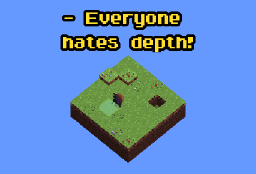

    

This is a depth-based puzzle-game made in 48 hours, as an entry the 8th Alakajam competition. It is coded in Java with LWJGL library.

https://alakajam.com/8th-alakajam/857/everyone-hates-depth

---

## Requirements

- Java 8

## Launch

- Go to **release** directory
- Launch **run** script file (.bat/.sh)

## Controls

| Action | Keyboard | Controller |
| - | - | - |
| Move Atlas | Arrows / WASD | Joystick |
| Pick up / drop dirt | Space / E | Any button |
| Reset level | Enter | |
